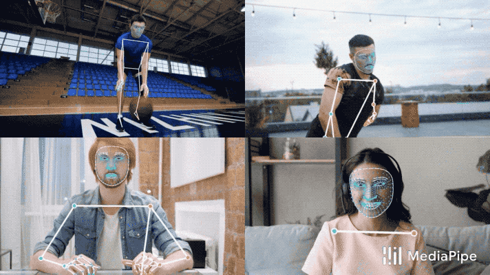

.. raw:: latex

    % Switch back to two-column layout
    \twocolumn

====================================================
American Sign Language Recognition with DeepLearning
====================================================

.. raw:: latex

    \small
    \textbf{\textit{Abstract}} - \textbf{This study presents the research conducted during the Certificate of Advanced Studies (CAS) in Advanced Machine Learning program of 2022 at the University of Bern, focusing on the development of an intricate approach for the recognition of distinct signs in American Sign Language (ASL). The work is inspired from the 2023 Kaggle Isolated Sign Language Recognition challenge by Google [1]. The cornerstone of this project is building a robust and deep-learning framework-agnostic setup that can be adapted to train models in either TensorFlow or PyTorch, wherein exhaustive testing with numerous models to identify one among 250 unique signs in short video sequences supplied by Kaggle. The highest-performing models yielded an overall test accuracy of approximately 78 \%. The design of this project framework is modular, making it a viable reference for future endeavours in diverse deep learning tasks.}

    \par

    \textbf{\textit{Keywords -  Sign Language Recognition, American Sign Language (ASL), Kaggle Isolated Sign Language Recognition challenge, Deep learning}}

    \normalfont

Introduction
-------------

For the development of a game to facilitate learning sign language, Google has partnered with the Georgia Institute of Technology, the National Technical Institute for the Deaf at Rochester Institute of Technology, and Deaf Professional Arts Network to compile a comprehensive data set so that a model can be developed to help learn the language [5].

In response to these challenges, we developed machine learning models capable of recognizing and classifying isolated ASL signs.
Unlike previous attempts [6], our current models have been developed using both TensorFlow and PyTorch frameworks, demonstrating our commitment to the utilization of state-of-the-art technologies.
We have implemented a deep learning framework agnostic trainer, which allows us to train these models and document the results in a flexible, efficient manner.
Our aim was to provide a more effective tool for ASL recognition and learning, creating a more inclusive environment for deaf children and their families, thereby improving communication, and reducing the potential impacts of Language Deprivation Syndrome.

Scope of the project
====================

The objectives of this project were dual pronged.
The first aim was to leverage the power of Deep Learning to extract valuable insights from an existing dataset.
Concurrently, we strived to avoid binding our project to a single Deep Learning framework.
Our approach was focused on establishing a versatile boilerplate setup conducive for the development of models using both PyTorch and TensorFlow frameworks.
This strategy enabled us to delve into and exploit the unique capabilities and subtleties of each platform, ensuring our work was framework-agnostic and compatible with the most widely used Deep Learning technologies.

By implementing the boilerplate setup, we aimed to streamline the process of deploying Deep Learning models in real-world scenarios, regardless of the framework preference of the end-users.
The goal was to provide a unified and easily adaptable codebase that could be utilized by others working with Deep Learning models, simplifying the transition from development to deployment.
Through this project's scope, we sought to advance our understanding of Deep Learning concepts, maximize the potential of the dataset, and contribute to the broader Deep Learning community by providing a practical solution for model deployment using PyTorch and TensorFlow.

In the spirit of creating a user-friendly and dynamic setup, we centralized the control over various inputs through the config.py file.
This configuration file offers a one-stop solution for defining and tweaking project-specific parameters, settings, and variables.
Users can readily customize the project's behavior and characteristics by simply adjusting the values in the config.py file, thereby eliminating the need to directly modify the code.

The project involved rigorous data preprocessing, cleaning, and augmentation to tailor the dataset for the specific use case.
The setup was designed to be scalable, capable of handling larger datasets or more complex models.
It was built with a view to accommodate future developments in deep learning and sign language recognition.
One key aspect of the scope was to create reusable modules and functions to ensure that parts of the project can be easily used in other similar tasks, thereby reducing future development time.
Thereby we entailed detailed documentation to ensure that other researchers and developers can easily understand and extend the work done.

Dataset
=======

The dataset used for this project was provided by Google and hosted by Kaggle and was part of the 2023 challenge Isolated Sign Language Recognition [1][3]. 
This rich and comprehensive dataset has been a joint contribution from Google, the Georgia Institute of Technology, the National Technical Institute for the Deaf at Rochester Institute of Technology, and Deaf Professional Arts Network.
The data comprised a total of *54.43 GB* of processed data.
split into 94’479 unique files containing one of 250 distinct signs. 
Each sign is performed by different participants, thus capturing a wide variety of signing styles, personal quirks, and potential minor variations in sign performance. 
This arrangement allows for the capture of a broad spectrum of signing styles, personal idiosyncrasies, and possible minor discrepancies in sign execution. 
The breadth and depth of this dataset make it an invaluable resource for understanding and modeling sign language patterns.
The videos are preprocessed using the MediaPipe -Holistic pipeline :cite:p:`DBLP:journals/corr/abs-1906-08172` and are thus represented as a series of 543 distinct landmark coordinates (x,y,z). 
The landmarks comprise coordinates for pose, both hands, and face. 
This representation not only helps reduce the data complexity but also enables efficient and accurate analysis of the sign language patterns.

   Example of landmarks gathered from MediaPipe Holistic Model. Source of the image: MediaPipe github repository.

This is the content of section 2.
.. raw:: latex

    \blindtext
    \blindtext
    \blindtext

Modeling
==============

Given that the proposed problem involves classifying sequences of data, specifically sequences of frames with coordinates,
it can be considered as a multidimensional sequence classification problem [9].
In such cases, sequence modeling techniques are often well-suited for addressing these challenges effectively.
Sequence modeling approaches are designed to capture and understand the dependencies and patterns present in sequential data.
These techniques consider the temporal nature of the data and aim to learn representations or models that can effectively capture and exploit the sequential information.

To ensure maximum flexibility and facilitate the implementation and testing of different models, a custom Trainer class was developed as a bridge between the TensorFlow and PyTorch deep learning frameworks.
This Trainer class serves as an interface for training, validating, and testing models, allowing seamless transitions between the two frameworks.
With this Trainer class, the project benefits from a consistent and standardized approach to model training and evaluation, regardless of whether TensorFlow or PyTorch is being used.
This class abstracts away the framework-specific details, providing a higher-level interface for working with models, datasets, optimization, and evaluation metrics.

Our initial hypothesis for training with processed fixed sequence data of ASL signs led us to focus on sequence-based models like LSTM and Transformers.
These models have shown promising results in handling sequential data, outperforming older models like RNNs in terms of accuracy.
While CNNs, such as ResNet-152 used for baseline comparison, have their strengths, they are not inherently designed for sequence data.
We then moved to explore an array of model architectures, creating multiple combinations of LSTM and Transformer models and even creating ensembles to maximize accuracy.

Subsequent sections provide an in-depth exploration and discussion of the various models we experimented with, the challenges we faced, and the results we obtained.

Baseline Computer-Vision Model (CV)
-----------------------------------

Our preprocessing routine, detailed in chapter III, shaped the input sequences into a format akin to image data. The sequences took the shape of (BATCH_SIZE, 32,96,2) for  (BATCH_SIZE, SEQ_LEN, Number of landmarks, Number of coordinates). This strongly resembles the shape of images. (…, Height, Width, channels). Thus, given this resemblance to image data, simple computer vision (CV) techniques were tested as an initial approach to the problem.

Summarize the main findings and conclusions of the report.

.. raw:: latex

    \blindtext
    \begin{figure*}[h]
    \includegraphics[width=1.0\textwidth]{logo.png}
    \caption{Figure caption goes here.}
    \end{figure*}
    % add some blindtext
    \blindtext

    \blindtext
    \blindtext
    \blindtext

.. image:: _static/logo.png

.. math::
   :label: eqn1

   L(y, \hat{y}) = -\frac{1}{N} \sum_{i=1}^{N} y_i \log(\hat{y}_i) + (1-y_i) \log(1-\hat{y}_i)

As shown in Equation :eq:`eqn1`, the loss function is defined as ...
:cite:p:`vaswani2017attention`.

.. csv-table::
    :label: asdfsadfasdf
   :header: Metric, count, mean, std, min, 25%, 50%, 75%, max

   Value, 250, 37.9, 5.2, 26.4, 34.3, 37.8, 41.2, 58.8

.. csv-table::
   :file: ../../out/Summary.csv
   :header-rows: 1
   :widths: 45, 11, 11, 11, 11, 11

.. csv-table::
   :header: MODELNAME, Acc., Loss, F1, Prec., Rec.
   :widths: 45, 11, 11, 11, 11, 11

   HybridEnsembleModel, 0.61, 1.57, 0.59, 0.62, 0.60
   TransformerEnsemble, 0.62, 1.66, 0.61, 0.62, 0.61
   YetAnotherEnsemble, 0.75, 1.25, 0.73, 0.74, 0.74
   HybridModel, 0.75, 0.96, 0.74, 0.75, 0.74
   HybridEnsembleModel, 0.75, 1.32, 0.74, 0.75, 0.74
   HybridModel, 0.76, 1.38, 0.75, 0.77, 0.75

=============
References
=============

.. raw:: latex

    \begingroup
    %\def\section#1#2{}
    %\def\chapter#1#2{}
    \begin{thebibliography}{1234}

.. bibliography:: references.bib
    :style: unsrt

.. raw:: latex

    \end{thebibliography}
    \endgroup

.. raw:: latex

    \onecolumn
    \appendix
    % Redefine chapter numbering format for appendix
    \renewcommand{\thechapter}{\Alph{chapter}}
    \renewcommand{\thesection}{\thechapter.\arabic{section}}

