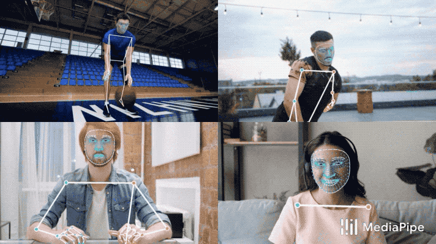

.. raw:: latex

    % Switch back to one-column layout
    \twocolumn

==============
Report
==============

Introduction
-------------

This is the introduction section of the report. Provide an overview of the report's purpose, scope, and key objectives.

Scope of the project
---------

The objectives of this project were dual pronged.
The first aim was to leverage the power of Deep Learning to extract valuable insights from an existing dataset.
Concurrently, we strived to avoid binding our project to a single Deep Learning framework.
Our approach was focused on establishing a versatile boilerplate setup conducive for the development of models using both PyTorch and TensorFlow frameworks.
This strategy enabled us to delve into and exploit the unique capabilities and subtleties of each platform, ensuring our work was framework-agnostic and compatible with the most widely used Deep Learning technologies.

By implementing the boilerplate setup, we aimed to streamline the process of deploying Deep Learning models in real-world scenarios, regardless of the framework preference of the end-users. The goal was to provide a unified and easily adaptable codebase that could be utilized by others working with Deep Learning models, simplifying the transition from development to deployment. Through this project's scope, we sought to advance our understanding of Deep Learning concepts, maximize the potential of the dataset, and contribute to the broader Deep Learning community by providing a practical solution for model deployment using PyTorch and TensorFlow.

In the spirit of creating a user-friendly and dynamic setup, we centralized the control over various inputs through the config.py file. This configuration file offers a one-stop solution for defining and tweaking project-specific parameters, settings, and variables. Users can readily customize the project's behavior and characteristics by simply adjusting the values in the config.py file, thereby eliminating the need to directly modify the code.

The project involved rigorous data preprocessing, cleaning, and augmentation to tailor the dataset for the specific use case. The setup was designed to be scalable, capable of handling larger datasets or more complex models. It was built with a view to accommodate future developments in deep learning and sign language recognition. One key aspect of the scope was to create reusable modules and functions to ensure that parts of the project can be easily used in other similar tasks, thereby reducing future development time. Thereby we entailed detailed documentation to ensure that other researchers and developers can easily understand and extend the work done.

Dataset
---------
The dataset used for this project was provided by Google and hosted by Kaggle and was part of the 2023 challenge Isolated Sign Language Recognition [1][3]. This rich and comprehensive dataset has been a joint contribution from Google, the Georgia Institute of Technology, the National Technical Institute for the Deaf at Rochester Institute of Technology, and Deaf Professional Arts Network.
The data comprised a total of 54.43 GB of processed data. split into 94’479 unique files containing one of 250 distinct signs. Each sign is performed by different participants, thus capturing a wide variety of signing styles, personal quirks, and potential minor variations in sign performance. This arrangement allows for the capture of a broad spectrum of signing styles, personal idiosyncrasies, and possible minor discrepancies in sign execution. The breadth and depth of this dataset make it an invaluable resource for understanding and modeling sign language patterns.
The videos are preprocessed using the MediaPipe -Holistic pipeline [4] and are thus represented as a series of 543 distinct landmark coordinates (x,y,z). The landmarks comprise coordinates for pose, both hands, and face. This representation not only helps reduce the data complexity but also enables efficient and accurate analysis of the sign language patterns.

   This is the caption for the image.

This is the content of section 2.
.. raw:: latex

    \blindtext
    \blindtext
    \blindtext

Conclusion
----------

Summarize the main findings and conclusions of the report.

.. raw:: latex

    \blindtext
    \begin{figure*}[h]
    \includegraphics[width=1.0\textwidth]{logo.png}
    \caption{Figure caption goes here.}
    \end{figure*}
    % add some blindtext
    \blindtext

    \blindtext
    \blindtext
    \blindtext

References
----------
.. raw:: latex

    \blindtext
- Reference 1
- Reference 2
- Reference 3

Appendix
--------

Include any additional supporting information, charts, figures, or data that may be relevant to the report.

.. raw:: latex

    % Switch back to one-column layout
    \onecolumn

